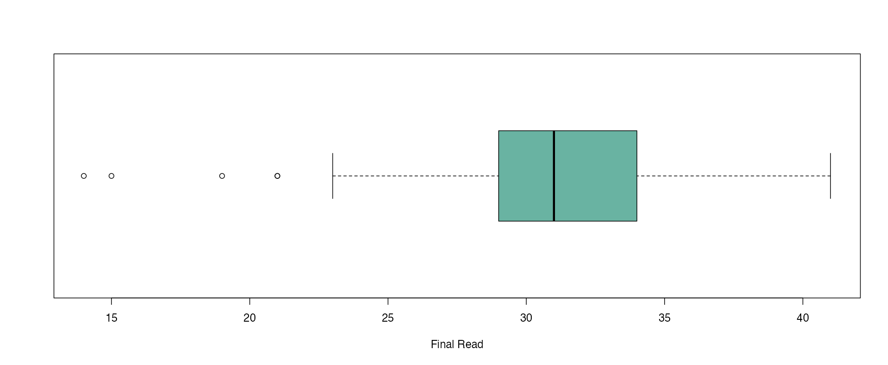
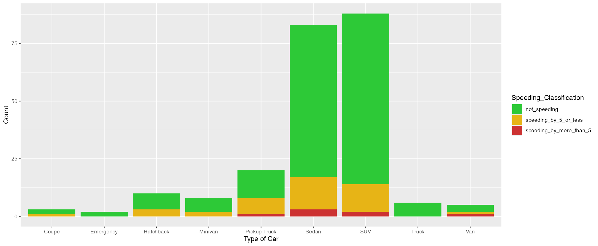
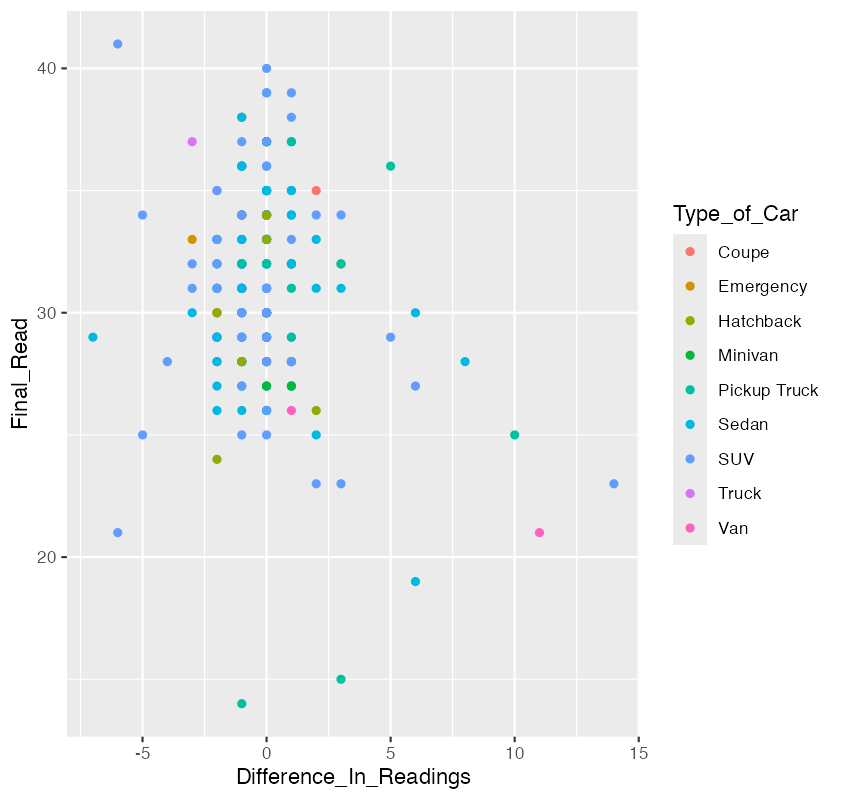
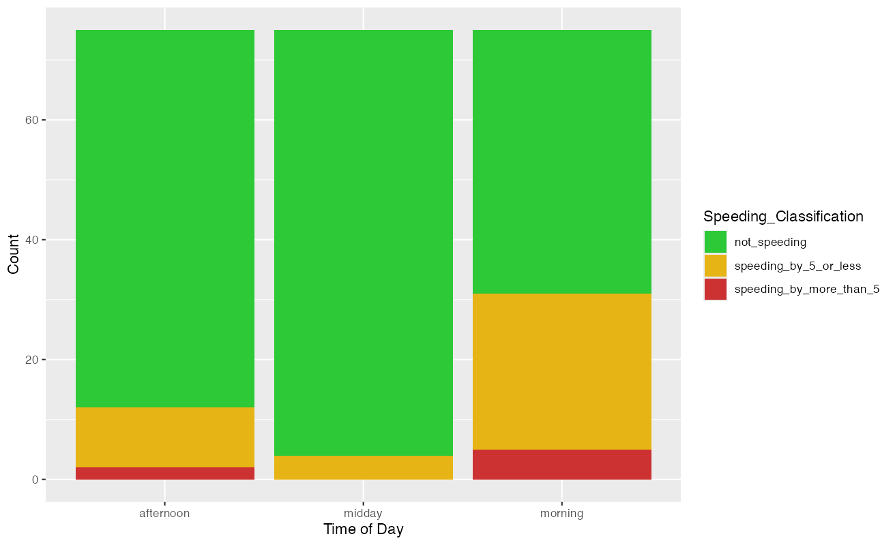

# DATA332 Counting Cars
<p> Contributors: Logan Farley, Tanner Buol, Sasha Botsul</p>

### This page analyzes the results of our collected car data. 

---
## Data Collection
- We decided to collect our data in an Excel sheet. We each collected our data on different days, during different times.
- Our collected data consisted of the initial read, final read, difference in readings, date and time of the day recorded, type of car, whether or not it was a commercial vehicle, state registered, weather, location, and name of the recorder for tracking records.
- We all went to the same location, the speedometer sign near the Thorson-Lucken Field.
- To complete the assignment, we met up to all work on it together. 

## Data Cleaning
1.  We removed the location and name of recorder column for our dataset.
```
dataset <- dataset[1:9]
```
2. While recording, we numbered the car types for easier collection.
   - We converted the numbered list into the type of car.
```
car_types <- c(
  "1" = "Emergency",
  "2" = "Hatchback",
  "3" = "Sedan",
  "4" = "SUV",
  "5" = "Van",
  "6" = "Minivan",
  "7" = "Motorcycle",
  "8" = "Coupe",
  "9" = "Truck",
  "10" = "Pickup Truck"
)

dataset$Type_of_Car <- car_types[as.character(dataset$Type_of_Car)]
```
3. Converting time from character value to a time bvalue using hms function.
```
dataset$Time_Recorded <- as_hms(dataset$Time_Recorded)

dataset <- dataset %>%
  mutate(Time_Category = case_when(
    Time_Recorded >= as_hms("00:00:00") & Time_Recorded < as_hms("12:00:00") ~ "morning",
    Time_Recorded >= as_hms("12:00:00") & Time_Recorded < as_hms("17:00:00") ~ "midday",
    Time_Recorded >= as_hms("17:00:00") & Time_Recorded <= as_hms("23:59:59") ~ "afternoon"
  ))
```
---
## BoxPlot with Final Speeds


- Min:14
- Max: 41
- Median: 31
- Mean: 31.05
- Standard Deviation: 3.97
- Outliers: 14, 15, 19, 21
- The median is just over the speed limit of 30. The interquartile range is from 28-34, meaning 50% of the speeds fall within this range. A large portion of the IQR is above 30 mph, meaning most of the drivers were speeding. The right whisker ends at 41, further portraying that the data is skewed above the speed limit. Based on this, we can assume that the presence of a speed sign may not lead to drivers decreasing their speed.
  
## Boxplot with Differences in Speed


- Min: -7
- Max: 14
- Median: 0
- Mean: -0.09
- Standard Deviation: 2.24
- Outliers: -7, -6, -5, -4, -3, 2, 3, 5, 6, 8, 10, 11, 14
- This box & whisker plot displays the difference in speed from a driver's initial vs. their final read. The mean and median both being at or near zero respectively show that the presence of a speed sign may not deter drivers from lowering there speed.

## Stacked Barchart with Speeding by Car Type


- In this chart the cars are classified by their type and by how much if at all they were speeding by. The red indicates more than 5 mph over the speed limit, yellow is under 5 over the speed limit, and green is not speeding. Our analysis shows that the majority of cars in this area are sedans and SUVs. Between these two majority groups, the Sedans show a higher probablity of the driver speeding than the SUV drivers.

## Scatterplot of Final Read vs. Difference in Reading by Type of Car


- It is clear that Sedan's and SUVs are the most common vehicle.
- Just like our boxplots above show, there is minimal differences between initial and final speed, ranging mostly from -2 to +2. 

## Stacked Barchart comparing Time of Day and Type of Speeder

- This charts showcases the three different time frames the car data was collected. This graph shows that more people speed during the mornings. This could be because of people trying to get to work or school. A drop off of speeders over 5 mph during the mid is seen but they return once again in the afternoon after they get off work.

---
# Conclusion
- Based on our analysis and the data we collected, the speedometer sign is ineffective at detering speeding near Thorson-Lucken Field. Our median final speed was above the speed limit and according to the differences in speed chart, about 50% of drivers actually sped up in their final read. 


