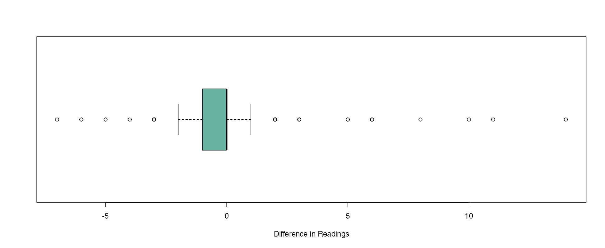

# DATA332 Counting Cars
<p> Contributors: Logan Farley, Tanner Buol, Sasha Botsul</p>

### This page analyzes the results of our collected car data. 

---
## Data Collection
- We decided to collect our data in an Excel sheet. We each collected our data on different days, during different times.
- Our collected data consisted of the initial read, final read, difference in readings, date and time of the day recorded, type of car, whether or not it was a commercial vehicle, state registered, weather, location, and name of the recorder for tracking records.
- We all went to the same location, the speedometer sign near the Thorson-Lucken Field.
- To complete the assignment, we met up to all work on it together. 

## Data Cleaning
1.  We removed the location and name of recorder column for our dataset.
```
dataset <- dataset[1:9]
```
2. While recording, we numbered the car types for easier collection.
   - We converted the numbered list into the type of car.
```
car_types <- c(
  "1" = "Emergency",
  "2" = "Hatchback",
  "3" = "Sedan",
  "4" = "SUV",
  "5" = "Van",
  "6" = "Minivan",
  "7" = "Motorcycle",
  "8" = "Coupe",
  "9" = "Truck",
  "10" = "Pickup Truck"
)

dataset$Type_of_Car <- car_types[as.character(dataset$Type_of_Car)]
```

---
## BoxPlot with Final Speeds


- Min:14
- Max: 41
- Median: 31
- Mean: 31.05
- Standard Deviation: 3.97
- Outliers: 14, 15, 19, 21
- The median is just over the speed limit of 30. The interquartile range is from 28-34, meaning 50% of the speeds fall within this range. A large portion of the IQR is above 30 mph, meaning most of the drivers were speeding. The right whisker ends at 41, further portraying that the data is skewed above the speed limit. Based on this, we can assume that the presence of a speed sign may not lead to drivers decreasing their speed.
  
## Boxplot with Differences in Speed


- Min: -7
- Max: 14
- Median: 0
- Mean: -0.09
- Standard Deviation: 2.24
- Outliers: -7, -6, -5, -4, -3, 2, 3, 5, 6, 8, 10, 11, 14
- This box & whisker plot displays the difference in speed from a driver's initial vs. their final read. The mean and median both being at or near zero respectively show that the presence of a speed sign may not deter drivers from lowering there speed.

## Stacked Barchart with Speeding by Car Type


## Scatterplot of Final Read vs. Difference in Reading by Type of Car


